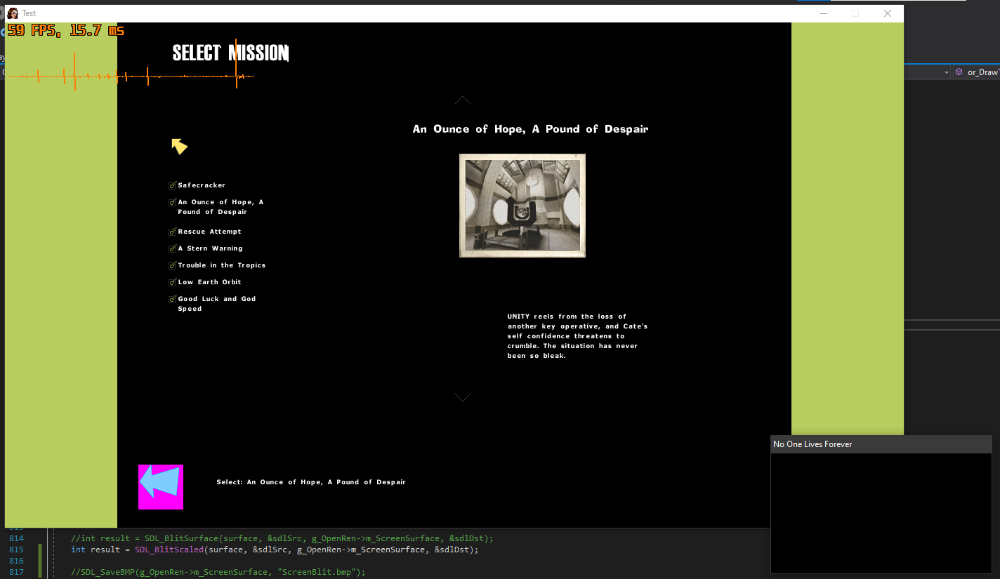

## Open Renderer

An experimental renderer replacement for No One Lives Forever 1. Don't expect this to work for a looong while!

The eventual goal is to have both a Null and OpenGL renderer.

A basic SDL2 2D renderer is functional for menus.

## Tools Used

Ghidra was used to decompile d3d.ren